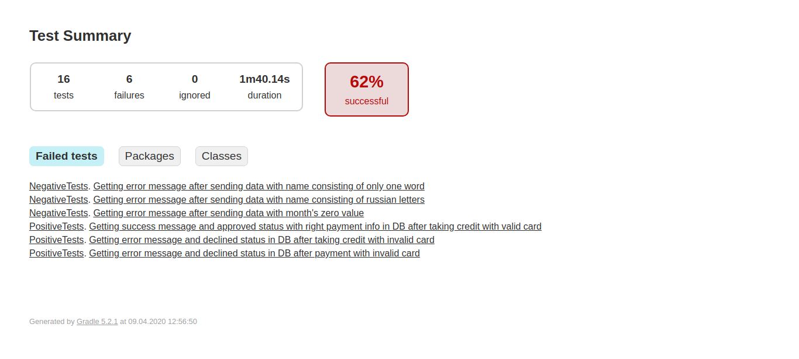

## Отчёт о выполненном тестировании

Данными тестами было проверено:
+ Заполнение полей допустимыми и недопустимыми значениями;
+ Запись в БД информации о статусе транзакций и методах оплаты;
+ Оповещение пользователя приложением.

Всего для системы подготовлено 16 тестов, 10 из которых пройдены успешно

#### Рекомендации

+ Ограничить варианты ввода для поля имени, чтобы отсутствовала возможность ввести имя на языке, отличном от английского;
+ Автоматическое преобразование регистра в верхний в поле для ввода имени владельца карты.
